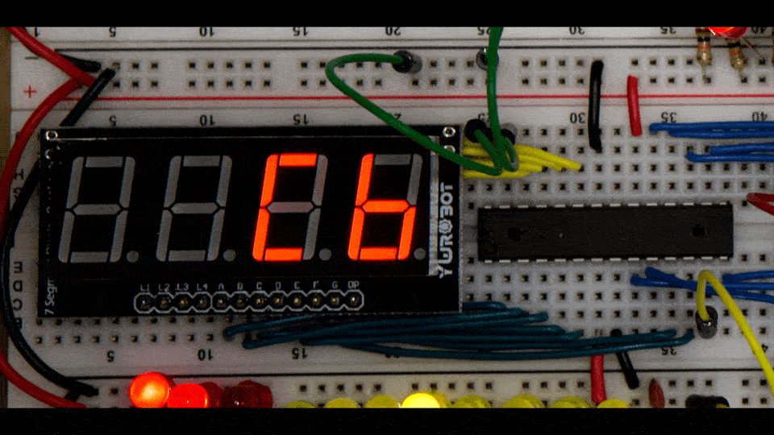
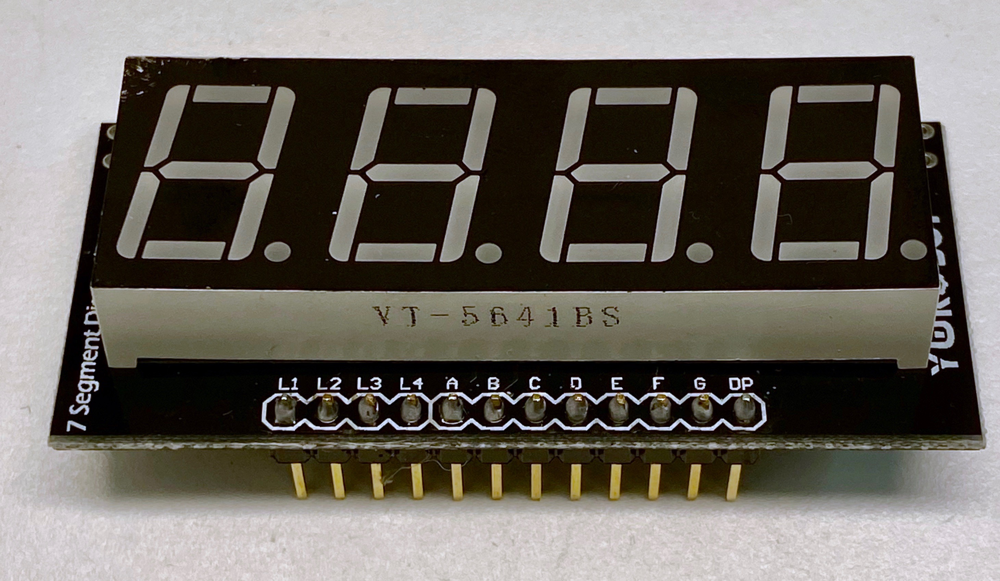
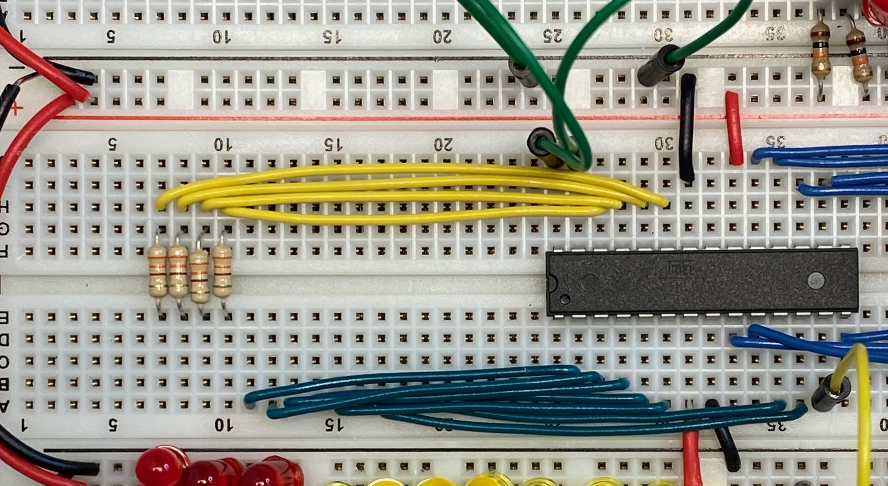
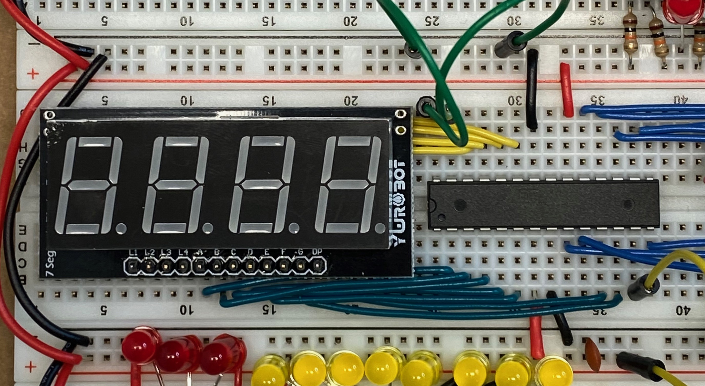

# Minimal Hardware 7-segment Driver

ATmega328 based driver for a 4-digit display using segment multiplexing instead of
digit multiplexing.  This allows for a simpler hardware design, with only 4 resistors
and no transistor drivers because no more than 4 segments (one per digit) will
be ON at any given time.  An 8-bit input value can be latched and displayed as
hex, signed decimal or unsigned decimal.

See [this project](https://github.com/gbhug5a/7-Segment-Displays-Multiplex-by-Segment)
for more details on segment multiplexing.

* Common anode and common cathode displays are supported, selectable at compile-time.

* One input pin is used to provide a LATCH function for the input data.  When the
LATCH pin is HIGH then the 8-bit value on the DATA input lines is stored and
displayed.  When the LATCH pin is LOW, the last stored data value is used.

* Seven output pins are used to drive the segments (no decimal point).
Four output pins (with resistors) are used to drive the digit select (LED common) pins.

* Eight input pins are used to read an 8-bit value for display.

* Two input pins are used for mode selection.  This allows the 8-bit data value to
be displayed as HEX (00-ff), unsigned decimal (0-255) or signed decimal (-128-127).
Changes to the mode selection are not latched by the LATCH pin.

* A wire test function can be enabled at compile-time to verify correct wiring between
the ATmega and the display.

To make wiring easier for different display hardware, all ports and bits can
be remapped with no other code changes subject to the following restrictions:
* MODE and digit selects must use a common port
  * MODE and digit selects can be remapped into any order within the port
  * Digit selects do not need to be consecutive or in order
* Segment selects and LATCH must use a common port
  * Segment selects and LATCH can be remapped into any order within the port
* The DATA inputs cannot be re-ordered within the data port.

## ATmega328 Connections

 Connection|Name|Pin|ATmega328 |Pin|Name|Connection
:---:|---:|:---:|:---:|:---:|:---|:---:
RESET|PC6/RST|1 | |28|PC5 |Mode1
Segment A|PD0|2 | |27|PC4 |Mode0
Segment B|PD1|3 | |26|PC3 |Digit3
Segment C|PD2|4 | |25|PC2 |Digit2
Segment D|PD3|5 | |24|PC1 |Digit1
Segment E|PD4|6 | |23|PC0 |Digit0
Vcc      |Vcc|7 | |22|Gnd |Gnd
Gnd      |Gnd|8 | |21|ARef|N/C
Data 6   |PB6|9 | |20|AVcc|Vcc
Data 7   |PB7|10| |19|PB5 |Data 5
Segment F|PD5|11| |18|PB4 |Data 4
Segment G|PD6|12| |17|PB3 |Data 3
Latch    |PD7|13| |16|PB2 |Data 2
Data 0   |PB0|14| |15|PB1 |Data 1

## Wiring Instructions

The display used was a
[MakerHawk 4-digit display with common anode](https://www.amazon.com/gp/product/B07BMPPNQY/).
This display was simple to wire because the board brings all of the pins out to
a single row at the bottom of the display.  Any similar 7-segment display should
work.  Be sure to set the common-anode or common-cathode #define option in the
code to match the display used.

The following photo and descriptions show how the board was wired as part of my
[breadboard computer](https://github.com/TomNisbet/breadboard-computer).
The resistors were mounted underneath the display to save board space.
* Segment lines (dark green) are connected directly between the ATmega328 PORT D
and the display
* Digit control lines (yellow) are connected through resisters from the ATmega
PORT C to the display
* Data lines (blue) are connected from the ATmega PORT B to the data source
* LATCH control (yellow) is tied HIGH to process changes in the data or LOW to latch the
previous value
* MODE control lines (green) are tied HIGH or LOW to select the display format

This photo shows the diplay mounted.  Because this display only has pins at the
bottom of the board, the resistors underneath provide some physical support so
the display doesn't tip back.

